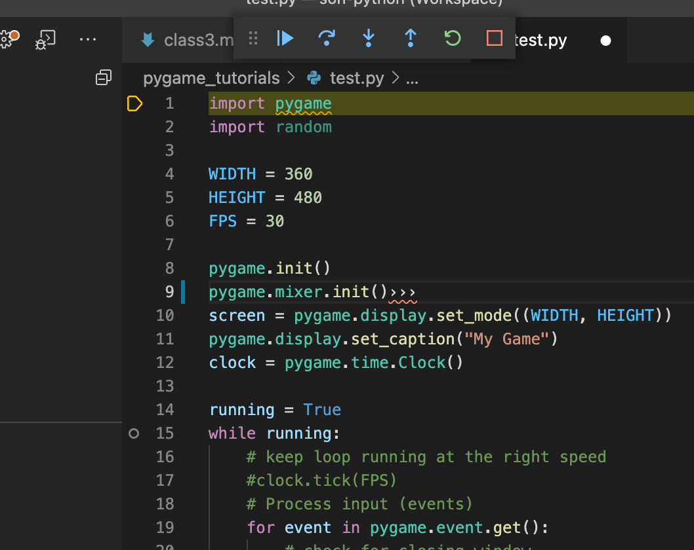

# 第四课：在游戏基础场景中展示一些内容

## 第一步： 设计显示游戏的 FPS 
接下来我们就要在游戏场景里展示点东西了，现在游戏里显示一下时间吧，让玩游戏的人别忘了时间，别玩过了头。我们之前设计了一个刷新率变量 FPS ，它是30，这是我们给程序预定刷新率目标。为了实现这个目标，我们需要有个时钟来控制它。pygame给提供了一个时钟 Clock 子对象。我们在 `while` 前声明一个变量：
```
# 先取到pygame提供的Clock对象
clock = pygame.time.Clock()
```
有了这一行代码，我们就有了一个可操作的时钟对象。我们在`while`循环里面使用这个对象来控制刷新率。
让我们在的后面加入这行代码，注意代码前面的空格，一定要超过`while`的位置，否则就不算`while`的循环内代码了
```
    # keep loop running at the right speed
    clock.tick(FPS)
```
clock这个时钟对象有一个tick()方法，他只接受一个整数作为参数，所以我们把我们之前定义好的 FPS 这个变量传给他，它就会在pygame.time.Clock()方法里定义预定的刷新率。

<br>现在我们定义了一个变量叫做`running`，我刚才说过变量其实是一些数，但是这里为什么叫 `True` 呢。 这是因为 ‘True’ 就是真正的常量，因为它是不允许你更改的。在大多数程序编译器里都有这样一个“常量”来代表‘对的’这个概念，而且是默认定义的不需要你自己来定义的，很多时候不允许你来定义的。Ture的值大多时候就是‘1’，对应的还有一个‘False’，你一会就会用到。它大多时候都是‘0’，这个值在不同的程序语言里其实并不固定，但是每种程序语言一定都会预留这样的常量，好让写程序的人不用考虑它门真的是什么值，而只是明确的知道自己可以用 Ture 来表示对的、是的、真的。用 False 来表示错的、假的、不对的、不是这样的。
<br>这里让 running = True 的意思就是对程序说：从现在起，我的程序的状态就是 `running` ，我不告诉你结束，running 的状态还是 True，你就一直执行下去。在下一步中，你就会用到这个重要的概念。

## 第二步： 建立一个永远执行的循环
如果我们想让上节课中定义的窗口真的显示出来，其实我们要一直让它干点什么事，如果它认为自己的事情干完了，就会继续向下执行程序里的后面的语句，直到执行到程序结束。所以程序是永远不会闲下来的，而且也没有自己执行下去的程序，包括你看到电脑上的各种窗口。如果你在程序里没有看到它在执行什么，那么一定是它在后台程序的什么地方写了一个类似下面的这样一个循环。在你的程序结束前加入下面这段代码。
```
while running:
    # 在这里等待 pygame 这个库已经定义好的各种事件的发生
    for event in pygame.event.get():
        # 在这里判断是否发生了由 pygame 这个库已经定义好的一个事件 QUIT
        if event.type == pygame.QUIT:
            #在这里把我们自己定义的继续执行这个标志变量变成‘不是’‘不要’‘不’
            running = False
```
这里一下用了2个循环和一个判断，他们被叠加在一起。这是我们写程序最常用的手段，来完成各种复杂的逻辑。
### while
`while`的意思是一直执行下面的内容，直到`while`后面的值是 False 才结束。在python程序中，while的后面是没有一个结束标志的，这是因为它会把`while`后面所有比他‘靠右’的代码都当作是他要不断执行的内容。不管你在后面加了‘空格’加了‘tab’等待让代码前面空置的部分比'while'多，它就会把它们都算在`while`的管辖范围。`while`会不断的把它管辖范围内的代码一直执行，直到你在他的后面加个 False 才结束。但是你看到我们在这里用的不是 False 也不是 True，而是running，为什么呢？这是因为running是变量，是可以变的！我们迟早会让 running 变成 False，当它变成 False 的时刻，就是我们希望 while 结束的时候。

### for
`for` 的意思是，如果 for ‘什么’ in ‘什么，什么’ : 只要后面这个‘什么什么’所代表的"数组"里还有数没用过，就将这个数放到前面的‘什么’这个变量里，然后执行`for`所管辖的所有代码。`for`的管辖范围和前面讲的`while`的管辖范围判断形式是一致的，只要后面比它靠右就被它管辖，直到出现第一个比它靠左的家伙出现，它就不在管辖了。数组还记得么？在上一节课曾经讲到过的，用一个名字代表一堆数，这个名字就叫一个“数组”。
<br>在这里for event in pygame.event.get() 的意思是：我向 pygame 这个库里面的 event这个属性里，用get()这个方法，向pygame要所有的它现有的 ‘event’ 事件信息。这里提到了“属性”和“方法”。如果希望更详细的理解，可以到这节课结束动作里去了解更多。在这里你只要直到，通过这个 get() 可以把 pygame 存在 event 里的所有事件都拿出来，交给 `for` 来执行，for会把每一个事件都放到 event 这个变量里，让后面的代码不断执行。这个单独的 event 和 pygame.event 是完全不相干的两个东西，event是我们这段程序自己的变量。而pygame.event 因为有个'.'所以代表那个event属于pygame。我们代码里为了能够更好的理解，特意把他们写成一样的名字，让大家知道我从 pygame要过来的是事件event。而处理的是这些事件event里的每一个event。其实你把它命名成其它名字，在`for`后面的程序里都用同样的名字，我们的程序执行结果不会有任何改变。你可以试一试哦。

### if
`if`代表了如果，如果 if 后面的这个结果是 Ture 是真的，那么我就执行管辖范围的代码，而如果是 False 则不执行管辖范围内的代码，直接跳过去，执行后面的内容。 `if` 的后面其实只有 Ture 或 False ，但为什么我们在这里放了一个 event.type == pygame.QUIT: 呢，这是因为这里用到的 ‘==’ 代表了比较。 ‘==’ 两边的值一样，‘==’判断的结果就返回 True ，不一样就返回 False。 这样`if`就知道了后面的代码要不要执行。 event 其实不是一个数，是一个结构，我们用event变量接收了一个放在 pygame.event 数组里面的 event。每个event其实还包含很多其它的属性。而这里我们只用 type （类型）这个属性。因此我们用 event.type 把这个值准确的找出来。同时 pygame 里为了大家使用清晰，把各种event类型都定义成常量，并给它一个好理解的名字，例如 QUIT 这个名字，它代表着这个事件类型是退出事件。这样大家都可以很简单的使用了。其实翻译过来这句话的意思是，检查一下，我当前拿到的这个事件 （event） ，他的事件类型（type）是不是退出事件（QUIT），如果是就执行后面的 running = False 。如果不是，那么就不执行，而 running 呢，就还是 True。这给后就又涉及到这个程序的总控制部分了。还记得现在咱们看到的这些都在 `while` 的总管辖范围吗？这里只要把 running 的值变成了 False，程序执行完就会回到`while`那里，`while`发现了这个变化就会跳出执行，执行`while`后面的代码，并执行到最后的退出程序，pygame.exit()。

## 第三步：执行程序与调试执行
### 执行程序
有了完整的程序，你就可以执行它了。我们现在能够看到，在你写的程序的整个窗口的右上角有一个绿色的三角，它代表执行，只要点击它，VSCode 这个工具就会调用 python 的执行命令，将你写好的程序按照规则执行一遍。当前执行的效果就是会出现一个可爱的窗口，只要你不去点击左上或右上角关闭的‘X’按钮，它就会一直在这里。现在可以去点绿三角了。

### 调试执行
很多时候，作为一个程序员，你会需要查看执行背后的逻辑。那么你现在可以尝试使用 VSCode 的调试执行功能了。看看VSCode最左边的一列按钮，其中有一个是三角形上有一个瓢虫🐞。至少我怀疑它是瓢虫，它代表Bug，在程序世界里代表一个意外的故障（程序世界里也有故意的故障哦）。点击这个图标以后，左边的窗口就会变成RUN窗口，里面只有一个按钮“Run and Debug”，只要点击它我们就可以开始一个特殊的运行状态，我们叫它“调试运行”。在调试运行状态下，有任何问题都会导致程序停下来。你也可以自己指定一个位置，让程序停下来。停下来以后你可以用上部的一系列按钮进行操作，操作包括逐步执行，跳过这一步，进入这一步，跳出这一步，重新启动，结束。像下面图片里显示的这样，在 while 的行号数字的前面，用鼠标点一下，会留下一个空心圆圈⭕️，这代表你计划在这一步停住，然后仔细琢磨一下你的程序发生了什么。留下这个暗号以后，程序执行到这里就会停住，等待你的下一步指令，你可以在这里尝试各种按钮，详细了解一下你的程序究竟是如何执行的。<br>

当停在这里时，⭕️就会变成实心圆。你有没有尝试过将鼠标放到一些你执行过的代码里的“变量”上？你会发现鼠标会告诉你这些变量在执行时究竟是什么“值”，你可以一边执行一边了解。执行到event的时候你会发现，event是一个非常复杂的家伙，可不像你想象的那么简单。


## 第四步：结束窗口，退出你的游戏
这节课的程序已经可以执行了，但是你有没有想过它是如何结束的？如果你理解了这节课的程序，你就会发现，平时常用的用“X”关闭窗口也并不简单，它其实是通过窗口体系向窗口控制程序发送了一个QUIT这样的事件。pygame是这么控制的，其它你通常执行的程序，包括游戏。基本上也是用相同的道理来实现的。这样你就可以理解为什么有些时候用“X”关不掉窗口，如果你的程序一直在执行什么无法退出的循环时，你的QUIT的事件根本没有机会被负责结束的控制程序接收，这样就没有人来负责替你关掉窗口了。所以写程序的时候要多考虑那些特殊情况，不要让你的程序被一些奇怪的循环卡住，还要多注意和你的使用者多交互，让他们知道你的程序在做什么，否则他们很容易变得暴躁、易怒！！
调试状态的关闭窗口就更简单了，你去按一下那个方框按钮，它会负责强制结束程序和调试状态，不管程序执行到什么阶段。

## 结束动作：别忘了把今天的工作放到Github上
参考第一课中的[结束动作](./FirstClass.md)将今天完成的程序也放到Github上。

## 回顾一下这一课都做了什么吧
### 理解一下判断、循环逻辑，特别是不同的循环执行方式的不同

### 理解一下属性与方法
现在的程序，我们都成为“面向对象编程”。这是一个很程序员的说法，其实它主要是一种编程的思维方式。在“面向对象编程”的思想里，所有的可以被操作的完整程序都应该是一个“对象”英文叫“Object”。对象在自己内部用程序来实现各种能力和对象。对的，对象里面还可以有对象，它们可以套娃，而且非常“套娃”。这样写出来的程序会更贴近真实世界的概念，特别是在程序特别复杂以后。你可以随便想一个真实世界的东西，他总是有不同的组成部分和不同的用途，还有不同的特征。在程序世界里组成部分就是“子对象”（SubObject）例如游戏机会包含一个手柄🎮，那么手柄就是游戏机的子对象；用途我们叫“方法”（Function），游戏机可以开机，开机这个动作我们就叫“开机方法”，开机方法就是按一下开机按钮，那么这个按钮就是我们方法里的“参数”，对于XBox合格对象还有另外一个开机方法，就是在🎮上按一下“X”按钮，所以我们就有了两个“方法”永远开机，而且方法分别在对象和它的子对象上。你看真实世界的概念和面向对象编程的理念都是一样的，这就是我们为什么越来越多的用这种方法来编程的原因；“特征”我们叫属性（Attribute），比如游戏机是黑的，就是它的属性，是方的也是它的属性，如果它有呼吸灯，它可以变颜色，那么它的属性就是可变的，而且我们可以通过呼吸灯这个“子对象”来控制游戏机对象的属性是否发生子改变。看你已经越来越有编程思维了吧！ 咱们程序里的 pygame.event.get() 就是通过“.”这个操作来找到子对象、属性、方法的过程。 pygame 是咱们引入的一个完成对象，它有很多event这子对象，event子对象会描述pygame所有发生的属性改变，包括running状态和QUIT状态属性。我们用 get() 这个event提供的方法可以渠道完整的event，然后我们在查看event.type这个属性是否是QUIT，只要是它就是QUIT事件，我们就该退出了，于是就结束循环，去执行pygame.quit()这个方法，来结束pygame这个对象。

### 理解一下调试运行状态时你能做什么

## [下一课，第五课](./class5.md)
## [回到主课程](./README.md)
